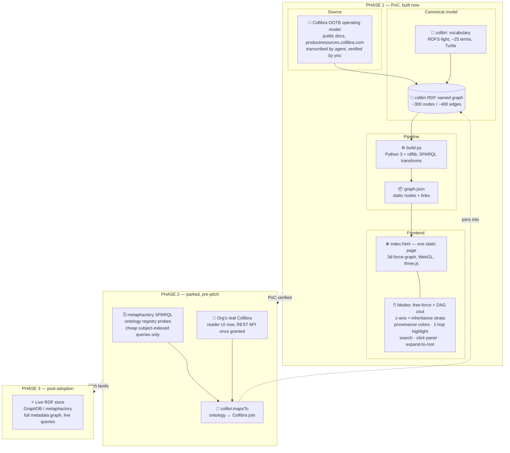

# Architecture

## System diagram

## Tech choices per step

| Step | Tech | Why this and not the alternative |
|------|------|----------------------------------|
| Source | Collibra public OOTB docs | No trial clock ticking, no API access needed; the metamodel is public |
| Canonical model | RDF, Turtle, RDFS-light | The artifact *is* an RDF knowledge graph — portable into the Phase 3 store unchanged, and mergeable with metaphactory's own Turtle exports in Phase 2 |
| Vocabulary | `colibri:` + `skos`, `rdfs`, `prov` | Tiny and readable; `colibri:mapsTo` reserved now so the Phase 2 join needs zero remodeling |
| Build | Python 3 + rdflib | SPARQL transforms in a script, no server; easy to verify against docs |
| Export | static JSON | ~300 nodes ship whole to the browser — no backend, nothing to break in the demo |
| Viz | 3d-force-graph (WebGL) | Native DAG `zout` mode = the z-axis inheritance strata; free-force toggle; renders one file |
| Interaction | vanilla JS, client-side | 1-hop highlight, expand-to-root = pointer-walking; no query engine at runtime — which is why Neo4j stays out |
| Phase 2 join | `colibri:mapsTo` | Already in the model; Phase 2 only supplies data |
| Phase 3 store | GraphDB or metaphactory itself | Queries become live; RDF stays canonical — no property-graph detour |

## Caveats

- The ~300 nodes / ~400 edges figure is an estimate from the docs' breadth, to be confirmed during transcription. The pipeline does not depend on the exact count.
- The Mermaid block above was not machine-validated (no `mmdc` in this environment); it uses the same conservative syntax already rendered successfully in chat.
